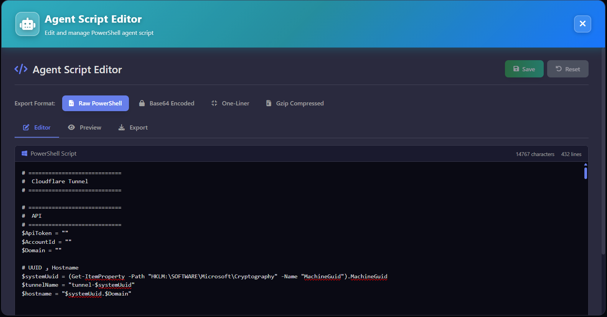

# ZeroPulse

<div align="center">

  


**A Modern Command & Control (C2) Platform with Cloudflare Tunnel Integration**

[](https://www.python.org/)
[](https://fastapi.tiangolo.com/)
[](https://reactjs.org/)
[](LICENSE)

</div>


---

## 📋 Table of Contents

- [Overview](#overview)
- [Features](#features)
- [Architecture](#architecture)
- [Prerequisites](#prerequisites)
- [Installation](#installation)
- [Configuration](#configuration)
- [Usage](#usage)
- [API Documentation](#api-documentation)
- [Security](#security)
- [Project Structure](#project-structure)
- [Development](#development)
- [Contributing](#contributing)
- [License](#license)
- [Acknowledgments](#acknowledgments)
- [Support](#support)

## 🎯 Overview

ZeroPulse is a comprehensive Command & Control (C2) platform designed for secure remote management and monitoring. It leverages Cloudflare Tunnel technology to provide secure, encrypted connections without exposing your infrastructure to the public internet.

> **⚠️ Development Status**: This project is currently in **active development**. This version is a **demo/alpha release** and some features may be:
> - **Unstable** or subject to breaking changes
> - **Incomplete** or partially implemented
> - **Under active development** with frequent updates
> 
> We recommend using this software for **testing and evaluation purposes only**. For production use, please wait for a stable release or use at your own risk.

### Key Highlights

- **🔒 Secure by Default**: Built-in authentication, session management, and API token system
- **🌐 Cloudflare Integration**: Seamless DNS and tunnel management via Cloudflare API
- **🖥️ Remote Management**: WinRM and SSH support with evil-winrm integration for interactive shells
- **📊 Modern UI**: Beautiful, responsive React interface with real-time terminal integration
- **🚀 Performance Optimized**: Non-blocking I/O, optimized database queries, and memory leak prevention
- **🖥️ Local Shell Access**: Interactive local shell via WebSocket with real-time terminal emulation

## ✨ Features

<div align="center">
   
  <p><em>ZeroPulse Dashboard - Overview of all tunnels and system status</em></p>
</div>

### Core Capabilities

- **Tunnel Management**
  - Create and manage Cloudflare Tunnels
  - Configure ingress rules (HTTP, HTTPS, TCP)
  - Automatic DNS record management
  - Route proxy management

- **Remote Command Execution**
  - Execute commands on remote Windows systems via WinRM
  - Interactive shell with evil-winrm integration (Password & NTLM Hash authentication)
  - SSH command execution and interactive sessions
  - PowerShell script execution
  - Command history tracking
  - Real-time output streaming
  - Module Control Panel with dynamic module execution

- **Remote Desktop**
  - VNC server detection and management
  - noVNC web-based remote desktop client
  - Support for Windows and Linux systems
  - Secure tunnel-based connections

- **Session & Security**
  - JWT-based authentication
  - Active session management
  - API token system with granular permissions
  - Token blacklisting and revocation
  - Role-based access control (RBAC)

- **DNS Management**
  - Automatic DNS record creation/updates
  - Support for CNAME, A, AAAA records
  - Cloudflare proxy configuration
  - Conflict resolution

- **Local Shell Access**
  - Interactive local shell via WebSocket
  - Real-time terminal emulation with xterm.js
  - Standalone window support
  - Non-blocking I/O for optimal performance

- **Module Control System**
  - Dynamic module loading from database
  - Hierarchical structure (Categories → Sections → Items)
  - Template engine with variable substitution
  - Interactive terminal integration
  - Command execution history


## ⚙️ Technology Stack

| Layer | Technology | Purpose |
|-------|-----------|---------|
| Frontend | React 19, Redux Toolkit, React Router, TailwindCSS, xterm.js | User interface |
| Backend | FastAPI, Uvicorn | API server |
| Database | SQLite (with optimized queries and indexes) | Data persistence |
| Authentication | JWT, python-jose | Token-based auth |
| Remote Execution | pywinrm, paramiko, evil-winrm | WinRM & SSH integration |
| Terminal | xterm.js, WebSocket | Interactive terminal |
| External APIs | requests, cloudflare | Service integration |
| Process Management | subprocess, asyncio, threading | Background tasks |

## 📦 Prerequisites

### System Requirements

- **OS**: Linux (Ubuntu 20.04+, Debian 11+, or any modern Linux distribution)
- **Python**: 3.8 or higher
- **Node.js**: 20.19.0+ or 22.12.0+ (see `.nvmrc` in frontend directory)
- **npm**: Comes with Node.js
- **Cloudflare Account**: With API token and account ID
- **Ruby** (optional): For evil-winrm support (`gem install evil-winrm`)

### Required Software

```bash
# Ubuntu/Debian
sudo apt update
sudo apt install -y python3 python3-pip python3-venv git curl

# Install Node.js 20+ (using nvm recommended)
curl -o- https://raw.githubusercontent.com/nvm-sh/nvm/v0.39.0/install.sh | bash
source ~/.bashrc
nvm install 20.19.0
nvm use 20.19.0

# Optional: Install Ruby for evil-winrm
sudo snap install ruby --classic
gem install evil-winrm

# Verify versions
python3 --version  # Should be 3.8+
node --version      # Should be 20.19.0+ or 22.12.0+
npm --version
```

## 🚀 Installation

<div align="center">
  
  <p><em>Installation Process - Setting up ZeroPulse on a new system</em></p>
</div>

### 1. Clone the Repository

```bash
git clone https://github.com/yourusername/zeropulse.git
cd zeropulse
```

### 2. Backend Setup

```bash
# Create virtual environment
python3 -m venv venv

# Activate virtual environment
source venv/bin/activate

# Upgrade pip
pip install --upgrade pip

# Install dependencies
pip install -r requirements.txt
```

### 3. Frontend Setup

```bash
cd frontend

# Check Node.js version (should be 20.19.0+ or 22.12.0+)
node --version

# If using nvm, switch to required version
nvm use  # Automatically uses version from .nvmrc

# Install dependencies
npm install

# Build frontend
npm run build

cd ..
```

### 4. Configure Environment Variables

Create a `.env` file in the project root:

```bash
cat > .env << EOF
# Authentication Settings
ADMIN_USERNAME=admin
ADMIN_PASSWORD=your-secure-password-here
JWT_SECRET_KEY=$(python3 -c "import secrets; print(secrets.token_urlsafe(32))")
JWT_ALGORITHM=HS256
JWT_EXPIRATION_HOURS=24

# Cloudflare Settings
CLOUDFLARE_API_TOKEN=your-cloudflare-api-token-here
CLOUDFLARE_ACCOUNT_ID=your-cloudflare-account-id-here
CLOUDFLARE_DOMAIN=your-domain.com

# WinRM Settings (optional)
WINRM_USERNAME=WinRMUser
WINRM_PASSWORD=your-secure-password-here

# SSH Settings (optional)
SSH_KEY_PATH=/path/to/ssh/key
SSH_USERNAME=ssh_user

# C2 Server Settings
C2_SERVER_HOST=0.0.0.0
C2_SERVER_PORT=8000
ENVIRONMENT=production

# Database Settings
DATABASE_PATH=data/database.db
EOF

# Set permissions
chmod 600 .env
```

### 5. Start the Server

```bash
# Ensure virtual environment is active
source venv/bin/activate

# Start the server
python3 run_server.py
```

The server will be accessible at `http://localhost:8000`

## ⚙️ Configuration

### Environment Variables

| Variable | Description | Default |
|----------|-------------|---------|
| `ADMIN_USERNAME` | Admin username | `admin` |
| `ADMIN_PASSWORD` | Admin password | - |
| `JWT_SECRET_KEY` | JWT signing key | - |
| `JWT_EXPIRATION_HOURS` | Token expiration time | `24` |
| `CLOUDFLARE_API_TOKEN` | Cloudflare API token | - |
| `CLOUDFLARE_ACCOUNT_ID` | Cloudflare account ID | - |
| `CLOUDFLARE_DOMAIN` | Your domain | - |
| `WINRM_USERNAME` | WinRM username | `WinRMUser` |
| `WINRM_PASSWORD` | WinRM password | - |
| `SSH_KEY_PATH` | SSH private key path | - |
| `SSH_USERNAME` | SSH username | - |
| `C2_SERVER_HOST` | Server host | `0.0.0.0` |
| `C2_SERVER_PORT` | Server port | `8000` |
| `ENVIRONMENT` | Environment mode | `development` |
| `DATABASE_PATH` | Database file path | `data/database.db` |

### Cloudflare API Token Permissions

Your Cloudflare API token needs the following permissions:

- **Zone**: `Zone:Read`, `DNS:Edit`
- **Account**: `Cloudflare Tunnel:Edit`
- **Zone Resources**: Include your domain zone


### Managing Tunnels

<div align="center">
  
  <p><em>Tunnel List - View all tunnels with status, health indicators, and quick actions</em></p>
</div>


#### Features

- **Dynamic Port Mapping**: Map local ports to tunnel routes
- **Service Proxying**: Proxy HTTP, HTTPS, and TCP services
- **Automatic Management**: Start, stop, and monitor proxy processes
- **Port Discovery**: Automatically find available ports
- **Status Monitoring**: Real-time status of all active proxies

1. **Create a Tunnel**: Navigate to Dashboard → Create Tunnel
2. **Configure Routes**: Set ingress rules for HTTP, HTTPS, or TCP services
3. **Manage DNS**: Automatic DNS record creation/updates
4. **Monitor Status**: View tunnel health and connection status

<div align="center">
  
  <p><em>Tunnel Routes Configuration - Configure ingress rules and DNS records</em></p>
</div>

### Remote Command Execution

<div align="center">
  
  <p><em>Command Execution Interface - Execute commands on remote Windows systems via WinRM And SSH</em></p>
</div>

1. **Select a Tunnel**: Choose a tunnel with WinRM or SSH access
2. **Execute Commands**: Run PowerShell commands on remote Windows systems
3. **View History**: Check command execution history and outputs

### Command History

<div align="center">
  
  <p><em>Command History - Comprehensive view of all executed commands with detailed information</em></p>
</div>

The Command History feature provides a complete audit trail of all command executions:

- **Execution Log**: View all commands executed across all tunnels
- **Detailed Information**: See command, output, timestamp, tunnel ID, and execution status
- **Filter & Search**: Filter by tunnel, date range, or search by command content
- **Output Viewing**: View full command output for each execution
- **Export Capabilities**: Export history for analysis or compliance

#### Features

1. **Comprehensive Logging**
   - All commands are automatically logged with timestamps
   - Includes tunnel information and execution context
   - Status tracking (success/failure)

2. **Advanced Filtering**
   - Filter by tunnel ID
   - Filter by date range
   - Search by command content or output
   - Filter by execution status

3. **Detailed View**
   - View full command output
   - See execution time and duration
   - Check tunnel and agent information
   - Review error messages if execution failed

4. **History Management**
   - Clear history for specific tunnels
   - Export history to file
   - Archive old entries

### Module Control Panel

<div align="center">
  
  <p><em>Module Control Panel - Centralized interface for managing all system modules and capabilities</em></p>
</div>

The Module Control Panel provides a unified interface for accessing and managing various system modules:

- **Interactive Shell**: evil-winrm integration for Windows systems (Password & NTLM Hash authentication)
- **Remote Desktop**: VNC/noVNC remote desktop access
- **Shell Access**: Command execution interface
- **Module Management**: Install, configure, and manage system modules
- **Status Monitoring**: Real-time status of all modules
- **Terminal Integration**: Persistent terminal modal across all module tabs

#

### Settings

<div align="center">
  
  <p><em>Settings Modal - Centralized configuration and management interface</em></p>
</div>

The Settings modal provides comprehensive system configuration and management through multiple tabs:

- **Modules**: PowerShell module management
- **Dependencies**: System dependency management
- **System Log**: View and monitor system logs
- **Active Sessions**: Session management
- **API**: API token management
- **Routes**: Tunnel routes configuration

#### Modules Management


Manage PowerShell modules that can be executed on remote systems:

- **Create Modules**: Define new PowerShell modules with custom code
- **Edit Modules**: Modify existing module code and configuration
- **Delete Modules**: Remove unused modules
- **Module Execution**: Execute modules on target systems
- **Template Variables**: Use variables in module code for dynamic execution

**Module Features:**
- Syntax highlighting for PowerShell code
- Variable substitution support
- Code validation
- Execution history tracking

#### Template Engine


The Template Engine allows you to create dynamic PowerShell modules with user-input variables. Variables are defined using the `_{...}_` syntax and are replaced with user-provided values before execution.

##### Variable Types

**1. Simple Text Input**
```powershell
ping _{ip,192.168.1.1}_
```
- **Format**: `_{name,placeholder}_`
- **Usage**: Text input field with placeholder
- **Example**: `ping _{target_ip,192.168.1.1}_` → User enters IP address

**2. Dropdown List**
```powershell
ping _{ip,list,(192.168.1.1,192.168.1.2,10.0.0.1)}_
```
- **Format**: `_{name,list,(option1,option2,option3)}_`
- **Usage**: Dropdown menu with predefined options
- **Example**: User selects from list of IP addresses

**3. Radio Buttons**
```powershell
netstat -an | findstr _{port,radio,(80,443,8080)}_
```
- **Format**: `_{name,radio,(option1,option2,option3)}_`
- **Usage**: Radio button group for single selection
- **Example**: User selects port number via radio buttons

**4. Checkbox**
```powershell
if (_{enable,check,(true,false),Enabled,Disabled}_) { Write-Host "Enabled" }
```
- **Format**: `_{name,check,(true_value,false_value),true_label,false_label}_`
- **Usage**: Checkbox for boolean values
- **Example**: Enable/disable feature with custom labels

##### Template Engine Workflow


1. **Module Creation**
   - Write PowerShell script with template variables
   - Use `_{variable}_` syntax for dynamic values
   - Save module in the system

2. **Variable Extraction**
   - System automatically extracts all variables from script
   - Identifies variable types (text, list, radio, checkbox)
   - Generates input form based on variables

3. **User Input**
   - When executing module, user sees input form
   - Form fields generated based on variable types
   - User fills in values for all variables

4. **Variable Replacement**
   - Template Engine replaces variables with user values
   - Script is prepared for execution
   - Original script remains unchanged

5. **Execution**
   - Modified script is executed on target system
   - Results are returned and displayed
   - Execution is logged in history

##### Example Module

**PowerShell Script:**
```powershell
# Network Scanner Module
$target = "_{target_ip,192.168.1.1}_"
$port = "_{port,radio,(80,443,8080)}_"
$scan_type = "_{scan_type,list,(ping,tcp,udp)}_"
$verbose = "_{verbose,check,(true,false),Yes,No}_"

if ($scan_type -eq "ping") {
    ping -n 4 $target
} elseif ($scan_type -eq "tcp") {
    Test-NetConnection -ComputerName $target -Port $port
} else {
    Write-Host "UDP scan for $target on port $port"
}

if ($verbose -eq "true") {
    Write-Host "Scan completed with verbose output"
}
```


**Generated Form:**
- **target_ip**: Text input (placeholder: 192.168.1.1)
- **port**: Radio buttons (80, 443, 8080)
- **scan_type**: Dropdown (ping, tcp, udp)
- **verbose**: Checkbox (Yes/No)

##### Best Practices

- **Use Descriptive Names**: Variable names should be clear and descriptive
- **Provide Placeholders**: Always include helpful placeholders for text inputs
- **Limit Options**: Keep dropdown/radio options manageable (5-10 items)
- **Validate Input**: Consider input validation in your PowerShell scripts
- **Document Variables**: Add comments explaining variable purpose

##### Advanced Usage

**Nested Variables:**
```powershell
$command = "ping _{ip}_ -n _{count,4}_"
Invoke-Expression $command
```

**Conditional Logic:**
```powershell
if (_{enable_feature,check,(true,false),Yes,No}_ -eq "true") {
    # Feature code
}
```

**Multiple Variables:**
```powershell
$server = "_{server_name,localhost}_"
$port = "_{port,list,(80,443,8080,8443)}_"
$protocol = "_{protocol,radio,(http,https)}_"
$url = "$protocol://$server`:$port"
```

#### Dependencies Management

<div align="center">
  
  <p><em>Dependencies Management - Manage system dependencies and requirements</em></p>
</div>

Manage system dependencies and requirements:

- **View Dependencies**: See all system dependencies (cloudflared, noVNC, ttyd, evil-winrm)
- **Check Status**: Verify dependency installation status
- **Install Dependencies**: Install missing dependencies with provided commands
- **Update Dependencies**: Update existing dependencies
- **Remove Dependencies**: Uninstall dependencies

**Supported Dependencies:**
- **cloudflared**: Cloudflare Tunnel daemon
- **noVNC**: HTML5 VNC client
- **ttyd**: Share terminal over the web
- **evil-winrm**: WinRM shell for pentesting (requires Ruby)

#### System Log

<div align="center">
  
  <p><em>System Log - View and monitor system logs in real-time</em></p>
</div>

Monitor system activity through comprehensive logging:

- **Real-time Logs**: View logs as they are generated
- **Log Filtering**: Filter by log level (DEBUG, INFO, WARNING, ERROR)
- **Search Functionality**: Search through log entries
- **Export Logs**: Export logs for analysis
- **Auto-refresh**: Automatic log updates

**Log Levels:**
- **DEBUG**: Detailed debugging information
- **INFO**: General informational messages
- **WARNING**: Warning messages
- **ERROR**: Error messages and exceptions

#### API Token Management

<div align="center">
  
  <p><em>API Token Management - Create and manage API tokens with granular permissions</em></p>
</div>

1. **Create Tokens**: Generate API tokens with specific permissions
2. **Manage Sessions**: View and terminate active sessions
3. **Monitor Activity**: Track token usage and expiration

#### Active Sessions

<div align="center">
  
  <p><em>Active Sessions Management - View and manage active user sessions</em></p>
</div>

View and manage active user sessions:

- **View All Sessions**: See all active user sessions
- **Session Details**: View session information (IP, user agent, duration)
- **Terminate Session**: End specific sessions
- **Terminate All**: End all sessions except current
- **Session Monitoring**: Monitor session activity in real-time

#### Routes Configuration

<div align="center">
  
  <p><em>Active Sessions Management - View and manage active user sessions</em></p>
</div>

Configure routes for all tunnels:

- **View All Routes**: See routes for all tunnels
- **Tunnel Selection**: Expand/collapse tunnels to view routes
- **Route Management**: Add, edit, and delete routes
- **DNS Status**: View DNS record creation status

### Agent Management

<div align="center">
  
  <p><em>Agent Script Editor - Create, edit, and customize PowerShell agent scripts for Windows deployment</em></p>
</div>

The Agent is a PowerShell script that automates the setup of Windows systems for remote management through ZeroPulse. It configures WinRM, creates Cloudflare Tunnels, and establishes secure connections.

#### Agent Features

- **Automated Setup**: One-click deployment script for Windows systems
- **WinRM Configuration**: Secure WinRM setup with HTTPS and certificate management
- **Cloudflare Tunnel Creation**: Automatic tunnel creation and DNS configuration
- **Customizable Script**: Edit and customize agent script before deployment
- **Template Engine**: Variable substitution for dynamic configuration


## 📚 API Documentation

<div align="center">
  
  <p><em>API Token Management - Create and manage API tokens with granular permissions</em></p>
</div>

### Interactive API Docs

Once the server is running, access the interactive API documentation:

- **Swagger UI**: `http://localhost:8000/docs`
- **ReDoc**: `http://localhost:8000/redoc`

### Authentication

All API endpoints (except `/api/auth/*`) require authentication:

```bash
# Include token in Authorization header
curl -H "Authorization: Bearer YOUR_JWT_TOKEN" \
     http://localhost:8000/api/tunnels
```

### Production Deployment

For production deployment:

1. Set `ENVIRONMENT=production` in `.env`
2. Use a reverse proxy (nginx/traefik) with SSL
3. Configure firewall rules
4. Set up log rotation
5. Use systemd service for auto-restart


<h2 id="contact">📧 Contact</h2>
<p >
<a href="https://t.me/amajax"></a>
<a href="https://www.youtube.com/channel/UC0-QcOXgzRgSfcE3zerwu9w/?sub_confirmation=1"></a>
<a href="https://www.instagram.com/jxroot"></a>

## ⚠️ Legal & Ethical Disclaimer

🚨 This tool is developed strictly for educational and authorized security testing purposes only.

🔬 It is intended to help cybersecurity professionals, researchers, and enthusiasts understand post-exploitation, red teaming, and detection techniques in lab or controlled environments.

❌ Do NOT use this tool on any system or network without explicit permission. Unauthorized use may be illegal and unethical.

🛡 The author takes no responsibility for any misuse or damage caused by this project.

---
> Always hack responsibly. 💻🔐

---

<div align="center">


</div>

